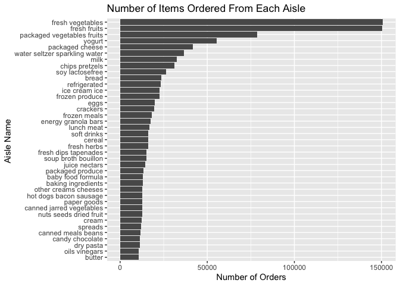

p8105\_hw3\_jc4166
================
Jerri Chen
2019-10-04

## Problem 1

``` r
library(p8105.datasets)
data("instacart")
instacart_data = instacart
```

Instagart is a dataset that contains 15 variables and 1384617 entries
describing Instacart customer orders, which are grocery store orders
placed online. Each entry represents a single order, and includes
information on the user who ordered, the day of week and hour of day
when the item was ordered, the order in which the item was added to
their cart, and information that categorizes the product into
departments and aisles.

  - Explore the data:
  - I am interested in what the most popular day of the week to place
    orders is.

<!-- end list -->

``` r
instacart_data %>% 
  select("order_dow") %>% 
  mutate(order_dow = case_when(
      order_dow == "0" ~ "Sunday",
      order_dow == "1" ~ "Monday",
      order_dow == "2" ~ "Tuesday",
      order_dow == "3" ~ "Wednesday",
      order_dow == "4" ~ "Thursday",
      order_dow == "5" ~ "Friday",
      order_dow == "6" ~ "Saturday")
    ) %>% 
  count(order_dow, name = "n_dow") %>% 
  arrange(desc(n_dow))
```

    ## # A tibble: 7 x 2
    ##   order_dow  n_dow
    ##   <chr>      <int>
    ## 1 Sunday    324026
    ## 2 Saturday  207279
    ## 3 Monday    205978
    ## 4 Friday    176910
    ## 5 Tuesday   160562
    ## 6 Thursday  155481
    ## 7 Wednesday 154381

The most popular day of week for placing orders is Sunday.

  - What time on Sundays are people placing orders?

<!-- end list -->

``` r
instacart_data %>% 
  filter(order_dow == "0") %>% 
  select(order_hour_of_day) %>% 
  count(order_hour_of_day, name = "n_hour") %>% 
  arrange(desc(n_hour))
```

    ## # A tibble: 24 x 2
    ##    order_hour_of_day n_hour
    ##                <int>  <int>
    ##  1                14  31000
    ##  2                15  29221
    ##  3                13  28721
    ##  4                11  28534
    ##  5                12  27737
    ##  6                10  26824
    ##  7                16  26300
    ##  8                17  21110
    ##  9                 9  21045
    ## 10                18  15574
    ## # … with 14 more rows

The most popular time of day on Sunday to place an order is 2:00 PM, and
the top three hours are 1:00, 2:00, and 3:00 PM.

  - How many aisles are there, and which aisles are the most items
    ordered from?

<!-- end list -->

``` r
instacart_aisle = instacart_data %>%
  select(aisle, aisle_id) %>% 
  count(aisle, aisle_id, name = "n_aisle") %>% 
  arrange(desc(n_aisle))
```

There are 134 aisles. The “fresh vegetables” aisle has the most orders,
followed by “fresh fruits” and “packaged vegetables fruits.”

  - Make a plot that shows the number of items ordered in each aisle,
    limiting this to aisles with more than 10000 items ordered. Arrange
    aisles sensibly, and organize your plot so others can read it.

<!-- end list -->

``` r
instacart_data %>% 
  count(aisle) %>% 
  filter(n > 10000) %>% 
  mutate(aisle = fct_reorder(aisle, n, .desc = FALSE)) %>% 
  ggplot(aes(x = aisle, y = n)) + 
    coord_flip() + 
      geom_bar(stat = "identity") + 
    labs(
      title = "Number of Items Ordered From Each Aisle", 
      x = "Aisle Name ", 
      y = "Number of Orders"
      )
```

<!-- -->

  - Make a table showing the three most popular items in each of the
    aisles “baking ingredients”, “dog food care”, and “packaged
    vegetables fruits”. Include the number of times each item is ordered
    in your table.

<!-- end list -->

``` r
instacart_data %>% 
  filter(aisle %in% c("baking ingredients", "dog food care", "packaged vegetables fruits")) %>% 
  group_by(aisle, product_name) %>% 
  summarize(n = n()) %>% 
  top_n(3) %>% 
  arrange(desc(n)) %>% 
  knitr::kable(caption = 'Most Popular Items by Aisle')
```

| aisle                      | product\_name                                 |    n |
| :------------------------- | :-------------------------------------------- | ---: |
| packaged vegetables fruits | Organic Baby Spinach                          | 9784 |
| packaged vegetables fruits | Organic Raspberries                           | 5546 |
| packaged vegetables fruits | Organic Blueberries                           | 4966 |
| baking ingredients         | Light Brown Sugar                             |  499 |
| baking ingredients         | Pure Baking Soda                              |  387 |
| baking ingredients         | Cane Sugar                                    |  336 |
| dog food care              | Snack Sticks Chicken & Rice Recipe Dog Treats |   30 |
| dog food care              | Organix Chicken & Brown Rice Recipe           |   28 |
| dog food care              | Small Dog Biscuits                            |   26 |

Most Popular Items by Aisle

In packaged vegetables and fruits, the three most popular items are
organic baby spinach, organic raspberries, and organic blueberries. In
baking ingredients, the three most popular items are light brown sugar,
pure baking soda, and cane sugar. In dog food care, the three most
popular items are snack sticks, organix chicken & brown rice, and small
dog biscuits.

  - Make a table showing the mean hour of the day at which Pink Lady
    Apples and Coffee Ice Cream are ordered on each day of the week;
    format this table for human readers (i.e. produce a 2 x 7 table).

<!-- end list -->

``` r
instacart_data %>% 
    select(product_name, order_dow, order_hour_of_day) %>%
    filter(product_name %in% c("Pink Lady Apples", "Coffee Ice Cream")) %>%
    group_by(product_name, order_dow) %>%
    summarize(mean_hour = round(mean(order_hour_of_day))) %>%
    mutate(order_dow = case_when(
      order_dow == "0" ~ "Sunday",
      order_dow == "1" ~ "Monday",
      order_dow == "2" ~ "Tuesday",
      order_dow == "3" ~ "Wednesday",
      order_dow == "4" ~ "Thursday",
      order_dow == "5" ~ "Friday",
      order_dow == "6" ~ "Saturday")
    ) %>%
  pivot_wider(
    names_from = "order_dow",
    values_from = "mean_hour") %>%
  rename("Product Name" = product_name) %>% 
  knitr::kable(caption = 'Mean Hour of Day for Product Orders Each Day of the Week')
```

| Product Name     | Sunday | Monday | Tuesday | Wednesday | Thursday | Friday | Saturday |
| :--------------- | -----: | -----: | ------: | --------: | -------: | -----: | -------: |
| Coffee Ice Cream |     14 |     14 |      15 |        15 |       15 |     12 |       14 |
| Pink Lady Apples |     13 |     11 |      12 |        14 |       12 |     13 |       12 |

Mean Hour of Day for Product Orders Each Day of the Week

## Problem 2

``` r
library(p8105.datasets)
data("brfss_smart2010")
```

``` r
brfss_smart2010_data = brfss_smart2010 %>% 
  janitor::clean_names() %>% 
  filter(topic == "Overall Health")
```
