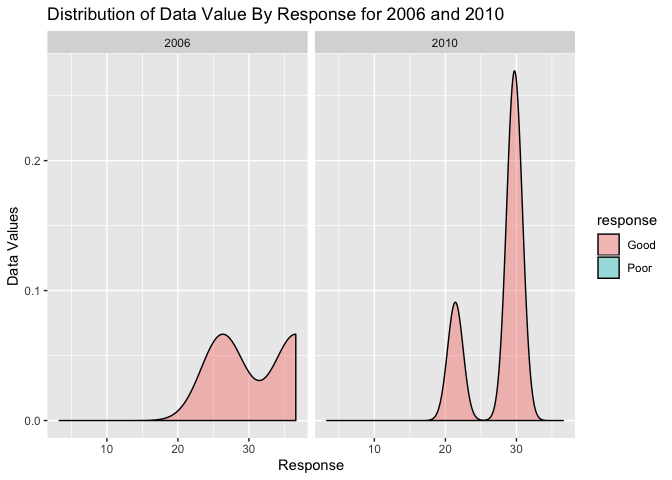

p8105\_hw3\_jc4166
================
Jerri Chen
2019-10-04

## Problem 1

``` r
library(p8105.datasets)
data("instacart")
instacart_data = instacart
```

Instagart is a dataset that contains 15 variables and 1384617 entries
describing Instacart customer orders, which are grocery store orders
placed online. Each entry represents a single order, and includes
information on the user who ordered, the day of week and hour of day
when the item was ordered, the order in which the item was added to
their cart, and information that categorizes the product into
departments and aisles.

  - Explore the data:
  - I am interested in what the most popular day of the week to place
    orders is.

<!-- end list -->

``` r
instacart_data %>% 
  select("order_dow") %>% 
  mutate(order_dow = case_when(
      order_dow == "0" ~ "Sunday",
      order_dow == "1" ~ "Monday",
      order_dow == "2" ~ "Tuesday",
      order_dow == "3" ~ "Wednesday",
      order_dow == "4" ~ "Thursday",
      order_dow == "5" ~ "Friday",
      order_dow == "6" ~ "Saturday")
    ) %>% 
  count(order_dow, name = "n_dow") %>% 
  arrange(desc(n_dow))
```

    ## # A tibble: 7 x 2
    ##   order_dow  n_dow
    ##   <chr>      <int>
    ## 1 Sunday    324026
    ## 2 Saturday  207279
    ## 3 Monday    205978
    ## 4 Friday    176910
    ## 5 Tuesday   160562
    ## 6 Thursday  155481
    ## 7 Wednesday 154381

The most popular day of week for placing orders is Sunday.

  - What time on Sundays are people placing orders?

<!-- end list -->

``` r
instacart_data %>% 
  filter(order_dow == "0") %>% 
  select(order_hour_of_day) %>% 
  count(order_hour_of_day, name = "n_hour") %>% 
  arrange(desc(n_hour))
```

    ## # A tibble: 24 x 2
    ##    order_hour_of_day n_hour
    ##                <int>  <int>
    ##  1                14  31000
    ##  2                15  29221
    ##  3                13  28721
    ##  4                11  28534
    ##  5                12  27737
    ##  6                10  26824
    ##  7                16  26300
    ##  8                17  21110
    ##  9                 9  21045
    ## 10                18  15574
    ## # … with 14 more rows

The most popular time of day on Sunday to place an order is 2:00 PM, and
the top three hours are 1:00, 2:00, and 3:00 PM.

  - How many aisles are there, and which aisles are the most items
    ordered from?

<!-- end list -->

``` r
instacart_aisle = instacart_data %>%
  select(aisle, aisle_id) %>% 
  count(aisle, aisle_id, name = "n_aisle") %>% 
  arrange(desc(n_aisle))
```

There are 134 aisles. The “fresh vegetables” aisle has the most orders,
followed by “fresh fruits” and “packaged vegetables fruits.”

  - Make a plot that shows the number of items ordered in each aisle,
    limiting this to aisles with more than 10000 items ordered. Arrange
    aisles sensibly, and organize your plot so others can read it.

<!-- end list -->

``` r
instacart_data %>% 
  count(aisle) %>% 
  filter(n > 10000) %>% 
  mutate(aisle = fct_reorder(aisle, n, .desc = FALSE)) %>% 
  ggplot(aes(x = aisle, y = n)) + 
    coord_flip() + 
      geom_bar(stat = "identity") + 
    labs(
      title = "Number of Items Ordered From Each Aisle", 
      x = "Aisle Name ", 
      y = "Number of Orders"
      )
```

<!-- -->

  - Make a table showing the three most popular items in each of the
    aisles “baking ingredients”, “dog food care”, and “packaged
    vegetables fruits”. Include the number of times each item is ordered
    in your table.

<!-- end list -->

``` r
instacart_data %>% 
  filter(aisle %in% c("baking ingredients", "dog food care", "packaged vegetables fruits")) %>% 
  group_by(aisle, product_name) %>% 
  summarize(n = n()) %>% 
  top_n(3) %>% 
  arrange(desc(n)) %>% 
  knitr::kable(caption = 'Most Popular Items by Aisle')
```

| aisle                      | product\_name                                 |    n |
| :------------------------- | :-------------------------------------------- | ---: |
| packaged vegetables fruits | Organic Baby Spinach                          | 9784 |
| packaged vegetables fruits | Organic Raspberries                           | 5546 |
| packaged vegetables fruits | Organic Blueberries                           | 4966 |
| baking ingredients         | Light Brown Sugar                             |  499 |
| baking ingredients         | Pure Baking Soda                              |  387 |
| baking ingredients         | Cane Sugar                                    |  336 |
| dog food care              | Snack Sticks Chicken & Rice Recipe Dog Treats |   30 |
| dog food care              | Organix Chicken & Brown Rice Recipe           |   28 |
| dog food care              | Small Dog Biscuits                            |   26 |

Most Popular Items by Aisle

In packaged vegetables and fruits, the three most popular items are
organic baby spinach, organic raspberries, and organic blueberries. In
baking ingredients, the three most popular items are light brown sugar,
pure baking soda, and cane sugar. In dog food care, the three most
popular items are snack sticks, organix chicken & brown rice, and small
dog biscuits.

  - Make a table showing the mean hour of the day at which Pink Lady
    Apples and Coffee Ice Cream are ordered on each day of the week;
    format this table for human readers (i.e. produce a 2 x 7 table).

<!-- end list -->

``` r
instacart_data %>% 
    select(product_name, order_dow, order_hour_of_day) %>%
    filter(product_name %in% c("Pink Lady Apples", "Coffee Ice Cream")) %>%
    group_by(product_name, order_dow) %>%
    summarize(mean_hour = round(mean(order_hour_of_day))) %>%
    mutate(order_dow = case_when(
      order_dow == "0" ~ "Sunday",
      order_dow == "1" ~ "Monday",
      order_dow == "2" ~ "Tuesday",
      order_dow == "3" ~ "Wednesday",
      order_dow == "4" ~ "Thursday",
      order_dow == "5" ~ "Friday",
      order_dow == "6" ~ "Saturday")
    ) %>%
  pivot_wider(
    names_from = "order_dow",
    values_from = "mean_hour") %>%
  rename("Product Name" = product_name) %>% 
  knitr::kable(caption = 'Mean Hour of Day for Product Orders Each Day of the Week')
```

| Product Name     | Sunday | Monday | Tuesday | Wednesday | Thursday | Friday | Saturday |
| :--------------- | -----: | -----: | ------: | --------: | -------: | -----: | -------: |
| Coffee Ice Cream |     14 |     14 |      15 |        15 |       15 |     12 |       14 |
| Pink Lady Apples |     13 |     11 |      12 |        14 |       12 |     13 |       12 |

Mean Hour of Day for Product Orders Each Day of the Week

## Problem 2

``` r
library(p8105.datasets)
data("brfss_smart2010")
```

``` r
brfss_smart2010_data = brfss_smart2010 %>% 
  janitor::clean_names() %>% 
  rename(
    "state" = locationabbr,
    "county" = locationdesc
         ) %>% 
  filter(topic == "Overall Health") %>% 
  filter(response == c("Poor", "Fair", "Good", "Very Good", "Excellent")) %>% 
  mutate(response = as.factor(response))
```

  - In 2002, which states were observed at 7 or more locations?

<!-- end list -->

``` r
brfss_smart2010_data %>% 
  filter(year == "2002") %>% 
  distinct(state, county) %>% 
  count(state) %>% 
  filter(n >= 7)
```

    ## # A tibble: 3 x 2
    ##   state     n
    ##   <chr> <int>
    ## 1 MA        7
    ## 2 NJ        8
    ## 3 PA        7

In 2002, the states NJ, MA, and PA were observed at 7 or more locations.

  - What about in 2010?

<!-- end list -->

``` r
brfss_smart2010_data %>% 
  filter(year == "2010") %>% 
  distinct(state, county) %>% 
  count(state) %>% 
  filter(n >= 7)
```

    ## # A tibble: 12 x 2
    ##    state     n
    ##    <chr> <int>
    ##  1 CA       12
    ##  2 CO        7
    ##  3 FL       37
    ##  4 MA        9
    ##  5 MD       10
    ##  6 NC       10
    ##  7 NE       10
    ##  8 NJ       19
    ##  9 NY        9
    ## 10 OH        7
    ## 11 TX       16
    ## 12 WA        7

In 2010, the states CA, CO, FL, MA, MD, NC, NE, NJ, NY, OH, TX, and WA
were observed in 7 or more locations.

  - Construct a dataset that is limited to Excellent responses, and
    contains, year, state, and a variable that averages the data\_value
    across locations within a state. Make a “spaghetti” plot of this
    average value over time within a state (that is, make a plot showing
    a line for each state across years – the geom\_line geometry and
    group aesthetic will help).

<!-- end list -->

``` r
brfss_excellent = brfss_smart2010_data %>% 
  filter(response == "Excellent") %>% 
  select("year", "state", "data_value") %>% 
  group_by(year, state) %>% 
  summarize(avg_data_value = mean(data_value, na.rm = TRUE))%>% 
  drop_na()

brfss_excellent %>% 
  ggplot(aes (x = year, y = avg_data_value, color = state)) + 
  geom_point() + 
  geom_line() + 
  labs(
    title = "Average Data Value Over Time for 'Excellent' Responses", 
    x = "Year", 
    y = "Average Data Value")
```

<!-- -->

  - Make a two-panel plot showing, for the years 2006 and 2010,
    distribution of data\_value for responses (“Poor” to “Excellent”)
    among locations in NY State.

<!-- end list -->

``` r
brfss_ny = brfss_smart2010_data %>% 
  filter(state == "NY") %>% 
  filter(year == c("2006", "2010")) %>% 
  select("year", "county", "response", "data_value")

brfss_ny %>% 
  ggplot(aes(x = data_value, fill = response)) + 
  geom_density(alpha = .4) + 
  facet_grid(~year) +
  labs(
      title = "Distribution of Data Value By Response for 2006 and 2010",
      x = "Response",
      y = "Data Values")
```

    ## Warning: Groups with fewer than two data points have been dropped.

<!-- -->

## Problem 3

This data set has 5 weeks worth of accelerometer data from a 63 year old
man with congestive heart failure. The data has been tidied, and
includes the following variables: week (1-5), day (Monday - Sunday),
day\_type (weekday or weekend), hour\_of\_day (0-23), minute\_of\_day
(1-1440), and activity\_counts, which counts the activities that occured
during the corresponding minute of day. Since it includes 5 weeks of
continuous 24-hour-a-day recordings, one would expect 5 weeks x 7 days a
week x 1440 minutes a day = 50,400 obersations, which is the exact
number of entries in the data set.

``` r
accel_data = read_csv("./data/accel_data.csv") %>% 
  janitor:: clean_names() %>% 
  mutate(day_type = ifelse(day %in% c("Saturday", "Sunday"), "weekend", "weekday")) %>%
  pivot_longer(
  activity_1:activity_1440, 
  names_to = "minute", 
  names_prefix = "activity_", 
  values_to = "activity_counts")%>% 
  mutate(minute_of_day = as.numeric(minute)) %>% 
  mutate(hour_of_day = as.integer(minute_of_day/60)) %>% 
  select("week", "day", "day_type", "hour_of_day", "minute_of_day", "activity_counts")
```

    ## Parsed with column specification:
    ## cols(
    ##   .default = col_double(),
    ##   day = col_character()
    ## )

    ## See spec(...) for full column specifications.

I tried to order the “day” variable using the following code within the
above code chunk and it seemed to do nothing: mutate(day =
as.factor(day)) %\>% group\_by(week) %\>% mutate(day = ordered(day,
levels = c(“Monday”, “Tuesday”, “Wednesday”, “Thursday”, “Friday”,
“Saturday”, “Sunday”))) %\>%

  - The following table show the average total activity count per day of
    week for the duration of the study. Saturday has the lowest activity
    count, and Friday the highest.

<!-- end list -->

``` r
accel_data %>% 
  group_by(day) %>% 
  summarize(total_activity = mean(activity_counts)) %>% 
  knitr::kable(caption = 'Average Activity Count Per Day of Week')
```

| day       | total\_activity |
| :-------- | --------------: |
| Friday    |        318.2931 |
| Monday    |        258.1526 |
| Saturday  |        190.1718 |
| Sunday    |        266.5574 |
| Thursday  |        290.4376 |
| Tuesday   |        249.8942 |
| Wednesday |        295.8017 |

Average Activity Count Per Day of Week

  - The following graph shows the 24-hour activity time courses for each
    day of the week. Overall, the majority of activity occurs between
    5am and 8pm, with a decrease around lunch time (as might be
    expected). It is possible he may participate in some kind of
    activity that increases his physical activity at certain times of
    week; for example, he has a lot of activity on Wednesday evenings
    and Sunday mornings. The day of the week that seems to have overall
    the lowest activity count throught the day is Tuesday.

<!-- end list -->

``` r
accel_data %>%
  ggplot(aes(x = hour_of_day, y = activity_counts, color = day)) + 
  geom_line() + 
  labs(
    title = "Activity Counts Over 24 Hour Period",
    x = "Hour of Day",
    y = "Activity Count")
```

<!-- -->
